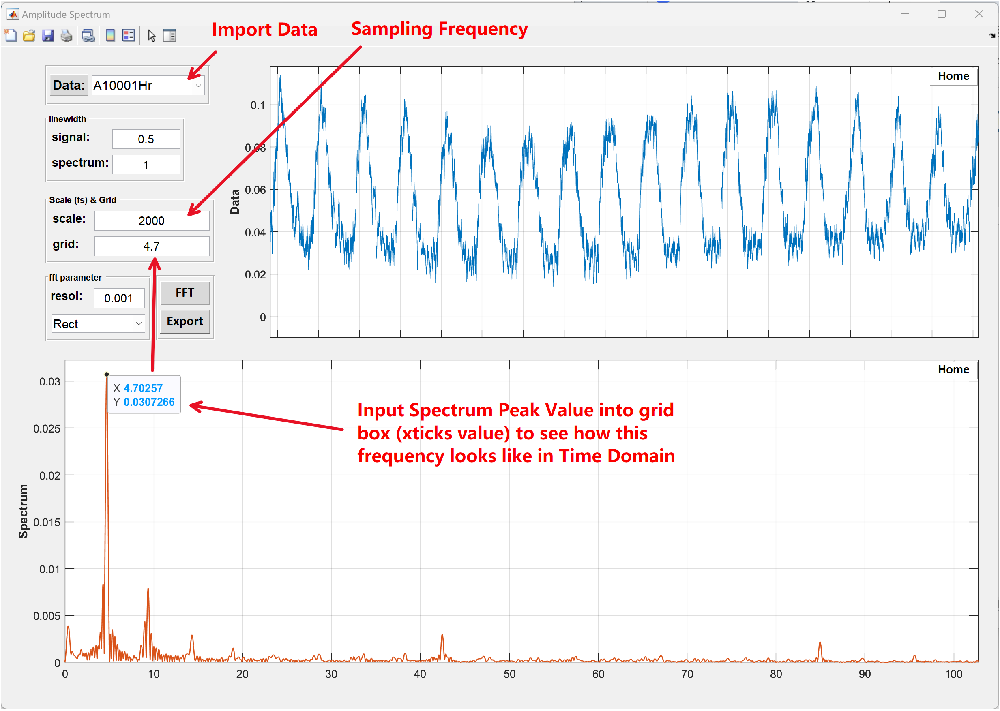

# Simple-Spectrum
 Data Spectrum Quick Check

1. Select Data
2. Zoom to the data you are interested, only calculate the data in the figure window
3. Set scale box (sampling frequency)
4. Set resol box (Spectrum Resolution)
5. After you get the Spectrum, you can use datatips to check the peak frequency. If you want to see how it looks like in time domain, put the frequency in the grid box, then the xticks in time domain figure window will be the frequency.

